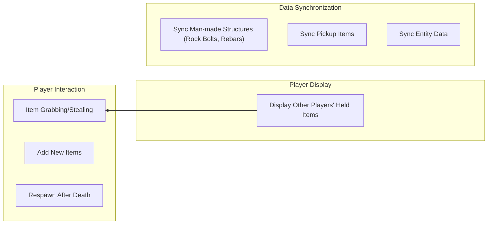

# White Knuckle Multi Player Mod - White Knuckle Online MOD

**[中文](README_CN.md)** | **English**

## Overview

This is a Unity MOD for the game  *White Knuckle* , implementing basic networked player mapping (currently only maps grabbable player capsules).

 **Important Disclaimer** :

* **I am not a Unity/C# developer by profession.**
* **Some code in this project is AI-generated.**
* Consequently,  **the quality of much of the code is likely very poor** . Please use with caution.
* The online multiplayer functionality code is  **forked from a previous online mod project** .

**Known Issues:**

* Chaotic object lifecycle management, which may lead to unexpected behavior.

**Potential Future Goals:**



---

## Installation

Download the required `.dll` files from the [Releases](https://github.com/Shen-X-L/WKMultiMod/releases) page and place them into the `BepInEx/plugins` directory within your game folder.

## Quick Start

### Prerequisites

1. **Game** : *White Knuckle b-0.52a*
2. **Framework** : [BepInEx](https://github.com/BepInEx/BepInEx) (Use a version compatible with your game version)

### Installation Steps

**bash**

```
# 1. Clone this repository locally
git clone https://github.com/Shen-X-L/WKMultiMod.git

# 2. Build the MOD
# Method A: Open and build WhiteKnuckleMod.sln in Visual Studio
# Method B: Use the command line
dotnet build -c Release
```

### Manual Installation

1. Copy the built `WhiteKnuckleMod.dll` file into your game directory's `BepInEx\plugins\` folder.
2. Copy the dependency `LiteNetLib.dll` file to the same `BepInEx\plugins\` folder.
3. Launch the game and check the BepInEx console or log files to confirm the MOD loaded successfully.

## Project Structure

**text**

```
WhiteKnuckleMod/
├── src/Core/                       # Mod core logic
│   ├─ Component/                   # Components that depend on game libraries, cannot be moved to Unity project
│   │   ├─ LocalPlayer.cs           # Component class, responsible for local player positioning
│   │   └─ RemoteEntity.cs          # Component class, responsible for dealing damage to other players
│   ├─ Core/
│   │   ├─ MPConfig.cs              # Reads configuration file data
│   │   ├─ MPCore.cs                # Core class, handles main events
│   │   └─ MPMain.cs                # Startup class, initializes patches
│   ├─ Data/
│   │   ├─ DataReader.cs            # Reads data from ArraySegment<byte>/byte[]
│   │   ├─ DataWriter.cs            # Writes data to ArraySegment<byte>
│   │   ├─ MPDataPool.cs            # Manages thread-isolated read/write object pools to avoid frequent memory allocation
│   │   ├─ MPDataSerializer.cs      # Serializes/deserializes PlayerData
│   │   ├─ MPEventBusGame.cs        # In-game data bus, handles in-game event publishing and subscription
│   │   └─ MPEventBusNet.cs         # Network data bus, facilitates communication between MPCore and MPSteamworks
│   ├─ NetWork/
│   │   ├─ MPLiteNet.cs             # IP-based connection (currently deprecated)
│   │   ├─ MPPacketHandler.cs       # Class for processing received data packets, dispatches data based on protocol
│   │   ├─ MPPacketRouter.cs        # Builds packet type → handler function dictionary via reflection, calls handler based on packet type
│   │   └─ MPSteamworks.cs          # Separated Steam networking logic class
│   ├─ Patch/
│   │   ├─ Patch.cs                 # Patches for map synchronization via unlock progress + disabled flipping
│   │   ├─ Patch_ENT_Player.cs      # Patches for capturing player events
│   │   └─ Patch_SteamManager.cs    # Patches for initializing MPCore via SteamManager lifecycle
│   ├─ RemotePlayer/
│   │   ├─ Factory/
│   │   │   ├─ BaseRemoteFactory.cs # Base class for remote object factories, provides interface for creating remote objects by cloning prefabs
│   │   │   └─ SlugcatFactory.cs    # Factory class with special handling for Slugcat prefab model
│   │   ├─ RPContainer.cs            # Handles data updates and lifecycle for a single remote player object
│   │   ├─ RPFactoryManager.cs       # Creates remote player objects and adds them to RPManager for management
│   │   └─ RPManager.cs              # Manages data updates and lifecycle for all remote player objects
│   ├─ Test/
│   │   ├─ Test.cs                  # Non-game-impacting test functions, allows quick modifications
│   │   └─ TestMonoSingleton.cs     # Test MonoSingleton, allows quick modifications
│   └─ Util/ 
│       ├─ Localization/       
│       │   ├─ Localization.cs      # Localization utility class, retrieves localized console text
│       │   ├─ json_sort.py         # Sorts JSON files in the Localization folder
│       │   ├─ texts_en.json        # English texts
│       │   └─ texts_zh.json        # Chinese texts
│       ├─ MonoSingleton.cs         # Base class for Unity component singletons, provides singleton pattern implementation for Unity
│       └─ Singleton.cs             # Base class for regular singletons, provides generic singleton pattern implementation
│
├── src/Shared/                     # Extracted Unity component logic for sharing with Unity project for rapid prefab construction
│   ├─ Component/                   # Components usable in Unity project
│   │   ├─ LookAt.cs                # Forces label to face player, scales label to maintain constant size
│   │   ├─ ObjectIdentity.cs        # Identifies the factory ID that created this object, used for proper destruction
│   │   ├─ RemoteHand.cs            # Controls hand position via network data
│   │   ├─ RemotePlayer.cs          # Controls player position via network data
│   │   ├─ RemoteTag.cs             # Controls label content via network data
│   │   └─ SimpleArmIK.cs           # Uses IK to connect arm to hand
│   ├─ Data/ 
│   │   ├─ HandData.cs              # Hand position data
│   │   └─ PlayerData.cs            # Player position data
│   ├─ MK_Component/                # Game-internal components, cannot be directly assigned, handled via mapping components
│   │   ├─ MK_CL_Handhold.cs        # Mapping for in-game CL_Handhold
│   │   ├─ MK_ObjectTagger.cs       # Mapping for in-game ObjectTagger
│   │   └─ MK_RemoteEntity.cs       # Mapping for mod's RemoteEntity
│   └─ Util/ 
│       ├─ DictionaryExtensions.cs  # Dictionary utility class, provides suffix matching, set difference operations, etc.
│       └─ TickTimer.cs             # Debug output frequency controller
│
├── lib/                            # External dependency directory (must be added manually)
│   └── README.md                   # Dependency acquisition guide
├── WhiteKnuckleMod.sln             # Visual Studio solution file
├── WhiteKnuckleMod.csproj          # Project configuration file
└── README.md                       # This document
```

## Development Guide

### Environment Setup

1. **Install .NET SDK** : Download and install from the [Microsoft .NET website](https://dotnet.microsoft.com/).
2. **Restore NuGet Packages** : Run `dotnet restore` in the project root directory.
3. **Obtain Game DLLs** : It is essential to follow the instructions in `lib/README.md` to acquire the necessary game DLL files and place them in the `lib/` directory.

### Dependency Notes

Compiling this project requires referencing some DLL files from the game itself ( **these files are copyrighted and must NOT be committed to this repository** ), primarily including:

* `Assembly-CSharp.dll`
* `UnityEngine.dll`
* `UnityEngine.CoreModule.dll`
* etc. (See `lib/README.md` for details).

### Key Build Configuration

The project file (`WhiteKnuckleMod.csproj`) is configured with key references and build targets, ensuring `TargetFramework` is set to `netstandard2.1` and allowing unsafe code.

## MOD Features Details

## Multiplayer Functionality

### Version 1.2/0.14

After enabling cheat mode (`cheats`) in-game, use the following commands:

* `host <lobby_name> [max_players]` - Create a lobby.
  * Example: `host abcde`
* `getlobbyid` - Get the lobby room code.
* `join <room_code>` - Join a lobby using the room code.
  * Example: `join 109775241951624817`
* `talk <text>` - Speak via the overhead label.
  * Example: `talk help me`
* `tpto <steamId(suffix match)>` - Teleport between players
  * Example: `tpto 22 (target ID: 561198279116422)`
* `getallplayer` - Get all player message

### Version 0.12

After enabling cheat mode (`cheats`) in-game, use the following commands:

* `host <port> [max_players]` - Host a server.
  * Example: `host 22222`
* `join <ip_address> <port>` - Join an existing host server.
  * Example: `join 127.0.0.1 22222` or `join [::1] 22222`
* `leave` - Leave the current host server.

### Configuration Options

shenxl.MultiPlayerMod.cfg 中
```
[Network]

## Sets how many times per second data is sent to other players.
# Setting type: Int32
DataSendFrequency = 20

[RemotePlayer]

## This value sets the scale size for player name tags above their heads.
# Setting type: Single
NameTagScale = 1

## Sets the model used for remote players. Default is 'default', you can set it to 'slugcat' to use the slugcat model.
# Setting type: String
Model = default

[RemotePlayerPvP]

## 
## DAMAGE TYPE REFERENCE:
## ---------------------
## Note: ×N means deals N instances of this damage type.
## 
## * Hammer - Type: Hammer, Damage: 1 (Hammer)
## * Auto Piton - Type: piton, Damage: 3 (Auto Piton)
## * Brick - Type: , Damage: 3 (Brick)
## * Flare Gun - Type: flare, Damage: 6 (Flare Gun)
## * Rebar/Bone Spears - Type: rebar, Damage: 10 (Rebar/Bone spears)
## * Rope Rebar - Type: , Damage: 10 (Rope Rebar)
## * Artifact Spear (throw/return) - Type: returnrebar, Damage: 10 (Artifact Spear)
## * Explosive Rebar - Type: explosion, Damage: 10 - Type: rebarexplosion, Damage: 10 (Explosive Rebar)
## * Cryo-Gun (uncharged/charged) - Type: ice, Damage: 10 - Type: , Damage: 0 × 2 (Cryo-Gun)
## 
## The Active configuration item controls the damage multiplier dealt by players.
## The Passive configuration item controls the damage multiplier received by players.
## 
## Formula:
## Final Damage = Base Damage × AllActive Multiplier × AllPassive Multiplier × Corresponding Type Active Multiplier × Corresponding Type Passive Multiplier

## Multiplier for all damage dealt by the player.
# Setting type: Single
AllActive = 0.2

## Multiplier for all damage received by the player.
# Setting type: Single
AllPassive = 1

## Multiplier for hammer damage dealt by the player.
# Setting type: Single
HammerActive = 5

## Multiplier for hammer damage received by the player.
# Setting type: Single
HammerPassive = 1

## Multiplier for rebar damage dealt by the player.
# Setting type: Single
RebarActive = 1

## Multiplier for rebar damage received by the player.
# Setting type: Single
RebarPassive = 1

## Multiplier for auto-piton damage dealt by the player.
# Setting type: Single

PitonActive = 1

## Multiplier for auto-piton damage received by the player.
# Setting type: Single

PitonPassive = 1

## Multiplier for flare gun damage dealt by the player.
# Setting type: Single

FlareActive = 1

## Multiplier for flare gun damage received by the player.
# Setting type: Single

FlarePassive = 1

## Multiplier for artifact spear (returnrebar) damage dealt by the player.
# Setting type: Single

ReturnRebarActive = 1

## Multiplier for artifact spear (returnrebar) damage received by the player.
# Setting type: Single

ReturnRebarPassive = 1

## Multiplier for explosion shrapnel (rebarexplosion) damage dealt by the player.
# Setting type: Single

RebarExplosionActive = 1

## Multiplier for explosion shrapnel (rebarexplosion) damage received by the player.
# Setting type: Single

RebarExplosionPassive = 1

## Multiplier for explosion shrapnel (explosion) damage dealt by the player.
# Setting type: Single

ExplosionActive = 1

## Multiplier for explosion shrapnel (explosion) damage received by the player.
# Setting type: Single

ExplosionPassive = 1

## Multiplier for cryo-gun ice spike damage dealt by the player.
# Setting type: Single

IceActive = 1

## Multiplier for cryo-gun ice spike damage received by the player.
# Setting type: Single

IcePassive = 1

## Multiplier for other damage dealt by the player.
# Setting type: Single

OtherActive = 1

## Multiplier for other damage received by the player.
# Setting type: Single
OtherPassive = 1
```
## Contributing

Welcome to submit Issues for bug reports or suggestions! Pull Requests are also welcome.

 **Reminder** : The code quality in this project is inconsistent, and some is AI-generated. Please keep this in mind when contributing.

### Contribution Process

1. Fork the repository.
2. Create your feature branch (`git checkout -b feature/YourAmazingFeature`).
3. Commit your changes (`git commit -m 'Add some AmazingFeature'`).
4. Push to the branch (`git push origin feature/YourAmazingFeature`).
5. Open a Pull Request.

### Code Style Suggestions

* Try to follow common C# naming conventions.
* Add comments to explain critical sections.
* Please test new features thoroughly.

## Important Copyright Notice:

* The game *White Knuckle* and its related DLL files are copyright of their respective developers/publishers.
* Use of this MOD requires you to own a legitimate copy of the game  *White Knuckle* .

## Acknowledgments

* **[Harmony](https://github.com/pardeike/Harmony)** - A powerful .NET runtime patching library.
* **[BepInEx](https://github.com/BepInEx/BepInEx)** - An excellent plugin framework for Unity games.
* ***White Knuckle* Game Community** - For inspiration and testing assistance.
* **Original Online Mod Author(s)** - For laying the groundwork with their open-source code.

## Contact

* **GitHub Issues** : [Submit issues or suggestions here](https://github.com/your-username/repo-name/issues)
* **Discord** : [https://discord.com/invite/f2CqdmUSap](https://discord.com/invite/f2CqdmUSap)
* **QQ Group** : 596296577
* **Author** : Shenxl - 819452727@qq.com
