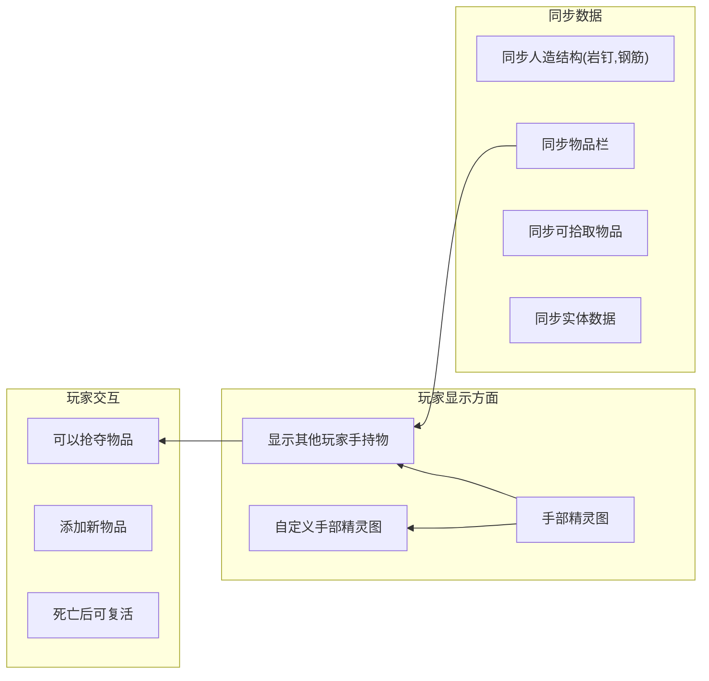

# White Knuckle Multi Player Mod - 白色节点联机MOD

**中文** | [English](README.md)

## 概述

这是一个为《白色节点》制作的 Unity MOD, 实现了简易联网玩家映射 (目前仅映射可抓握的玩家胶囊) .

 **重要声明** :

* **本人并非 Unity/C# 开发者, 日常工作不涉及此类开发.**
* 本项目中 **部分代码由 AI 生成** .
* 因此,  **部分代码质量可能非常糟糕** , 请谨慎参考.
* 联机功能相关的代码 **fork自之前存在的联机mod项目** .

 **存在的问题** :

* 对象生命周期混乱, 可能导致未预期的行为.

 **可能的目标** :



---

## 安装MOD

在 [Releases](https://github.com/Shen-X-L/WKMultiMod/releases) 页面下载所需的 `.dll` 文件, 放入游戏目录下的 `BepInEx/plugins` 目录中即可.

## 快速开始

### 前提条件

1. **游戏** :《White Knuckle》b-0.52a
2. **框架** :[BepInEx](https://github.com/BepInEx/BepInEx) (请使用与游戏版本兼容的版本)

### 安装步骤

**bash**

```
# 1. 克隆此仓库到本地
git clone https://github.com/Shen-X-L/WKMultiMod.git

# 2. 构建 MOD
# 方法A: 使用 Visual Studio 打开并构建 WhiteKnuckleMod.sln
# 方法B: 使用命令行
dotnet build -c Release
```

### 手动安装

1. 将构建生成的 `WhiteKnuckleMod.dll` 文件复制到游戏目录的 `BepInEx\plugins\` 文件夹下.
2. 将依赖 `LiteNetLib.dll` 文件复制到游戏目录的 `BepInEx\plugins\` 文件夹下
3. 启动游戏, 检查 BepInEx 控制台或日志文件, 确认 MOD 已成功加载.

## 项目结构

**text**

```
WhiteKnuckleMod/
├──src/Core/        # Mod核心逻辑
│   ├─Component/            # 所有需要游戏本体库无法移至Unity项目的组件
│   │   ├─LocalPlayer.cs    # 组件类,负责玩家本地位置
│   │   └─RemoteEntity.cs   # 组件类,负责对其他玩家的伤害
│   ├─Core/
│   │   ├─MPConfig.cs   # 读取配置文件的数据
│   │   ├─MPCore.cs     # 核心类,负责主要事件处理
│   │   └─MPMain.cs     # 启动类,用来启动补丁
│   ├─Data/
│   │   ├─DataReader.cs         # 读取ArraySegment<byte>/byte[]内部数据
│   │   ├─DataWriter.cs         # 写入ArraySegment<byte>数据
│   │   ├─MPDataSerializer.cs   # 将PlayerData序列化/反序列化
│   │   └─MPEventBusNet.cs      # 网络数据总线,负责MPCore和MPSteamworks交流
│   ├─NetWork/
│   │   ├─MPLiteNet.cs      # 暂时废弃
│   │   └─MPSteamworks.cs   # 拆分的steam网络逻辑类
│   ├─Patch/
│   │   ├─Patch.cs                  # 补丁,通过解锁进度+禁用翻转实现地图同步
│   │   ├─Patch_ENT_Player.cs       # 补丁,获取玩家的事件
│   │   └─Patch_SteamManager.cs     # 补丁,通过SteamManager的生命周期来初始化MPCore
│   ├─RemoteManager/
│   │   ├─RemotePlayerContainer.cs  # 负责单个远程玩家对象的数据更新等逻辑
│   │   └─RemotePlayerManager       # 管理全部远程玩家对象的生命周期
│   ├─Test/
│   │   └─Test.cs/  # 不影响游戏的测试函数,可以快速修改
│   └─Util/ 
│       ├─DictionaryExtensions.cs   # 字典后缀匹配,用于tpto命令
│       ├─MPDataPool.cs             # 线程独立的读写对象池
│       ├─TickTimer.cs              # Debug控制输出频率计数器
│       └─TypeConverter.cs          # 字符串转Bool工具
│
├──src/Shared/      # 提取的Unity组件逻辑,用于共享到unity项目快速构建预制体
│   ├─Component/    # 可以在Unity项目使用的组件
│   │   ├─LookAt.cs         # 让标签强制面向玩家,缩放标签使大小不变
│   │   ├─RemoteHand.cs     # 通过网络数据控制手部位置
│   │   ├─RemotePlayer.cs   # 通过网络数据控制玩家位置
│   │   ├─RemoteTag.cs      # 通过网络数据控制标签内容
│   │   └─SimpleArmIK.cs    # 通过IK使胳膊连接到手
│   ├─Data/ 
│   │   ├─HandData.cs           # 手部位置数据
│   │   ├─MPEventBusGame.cs     # 游戏内数据总线
│   │   └─PlayerData.cs         # 玩家位置数据
│   └─MK_Component/     # 游戏内的组件,无法直接赋予,通过映射组件处理
│       ├─MK_CL_Handhold.cs     # 游戏内CL_Handhold的映射
│       ├─MK_ObjectTagger.cs    # 游戏内ObjectTagger的映射
│       └─MK_RemoteEntity.cs    # Mod的RemoteEntity的映射
├── lib/                            # 外部依赖库目录 (需自行添加) 
│   └── README.md                   # 依赖库获取说明
├── WhiteKnuckleMod.sln             # Visual Studio 解决方案文件
├── WhiteKnuckleMod.csproj          # 项目配置文件
└── README.md                       # 本文档
```

## 开发指南

### 环境设置

1. **安装 .NET SDK** :从 [Microsoft .NET官网](https://dotnet.microsoft.com/) 下载并安装.
2. **恢复 NuGet 包** :在项目根目录执行 `dotnet restore`.
3. **获取游戏 DLL** :请务必按照 `lib/README.md` 中的说明, 获取必要的游戏 DLL 文件并放入 `lib/` 目录.

### 依赖库说明

本项目编译需要引用游戏本体的部分 DLL 文件 ( **这些文件受版权保护, 请勿提交至本仓库** ) , 主要包括:

* `Assembly-CSharp.dll`
* `UnityEngine.dll`
* `UnityEngine.CoreModule.dll`
* 等文件 (详见 `lib/README.md`) .

### 构建配置要点

项目文件 (`WhiteKnuckleMod.csproj`) 中已配置关键引用和构建目标, 确保 `TargetFramework` 为 `netstandard2.1` 并允许不安全代码.

## MOD 功能详情

## 联机功能

## 1.0/0.14

在游戏中开启作弊模式 (`cheats`) 后, 可使用以下命令:

* `host <名称> [最大玩家数]` - 创建大厅.
  * 示例:`host abcde`
* `getlobbyid` - 获取大厅大厅码
* `join <大厅码>` - 通过大厅码,加入大厅
  * 示例: `join 109775241951624817`
* `talk <文字(目前控制台不支持中文)>` - 来在头顶的标签上说话
  * 示例: `talk help me`
* `tpto <steamId(后缀匹配)>` - 进行玩家间tp
  * 示例 `tpto 22(目标id 561198279116422)` 
* `getallplayer` - 获取全部玩家

## 0.12

在游戏中开启作弊模式 (`cheats`) 后, 可使用以下命令:

* `host <端口号> [最大玩家数]` - 创建主机.
  * 示例:`host 22222`
* `join <IP地址> <端口号>` - 加入一个已创建的主机.
  * 示例:`join 127.0.0.1 22222` 或 `join [::1] 22222`
* `leave` - 离开当前连接的主机.

### 配置选项

shenxl.MultiPlayerMod.cfg 中
```
[Network]

## 设置每秒向其他玩家发送数据的次数.
# Setting type: Int32
DataSendFrequency = 20

[RemotePlayer]

## This value sets the scale size for player name tags above their heads.
## 这个值设置玩家头部名称的缩放倍率
# Setting type: Single
NameTagScale = 1

[RemotePlayerPvP]

## * 锤子 - 类型Hammer 伤害1
## * 自动钻头 - 类型piton 伤害3
## * 砖头 - 类型 伤害3
## * 信号枪 - 类型flare 伤害6
## * 钢筋/骨矛 - 类型rebar 伤害10
## * 带绳钢筋 - 类型 伤害10
## * 神器长矛(投出/返回) - 类型returnrebar 伤害10
## * 爆炸钢筋 - 类型explosion 伤害10 - 类型rebarexplosion 伤害10 × 2
## * 造冰枪(不蓄力/蓄力) - 类型ice 伤害10 - 类型 伤害 0 × 2
## 
## Active配置项控制玩家造成的伤害倍率
## Passive配置项控制玩家受到的伤害倍率
## 公式 : 最终伤害 = 基础伤害 × AllActive倍率 × AllPassive倍率 × 对应类型Active倍率 × 对应类型Passive倍率

## 玩家造成所有伤害类型的伤害倍率
# Setting type: Single.2
AllActive = 0.2

## 玩家受到所有伤害类型的伤害倍率
# Setting type: Single
AllPassive = 0

## 玩家可以使用锤子造成伤害的伤害倍率
# Setting type: Single
HammerActive = 5

## 玩家受到锤子伤害的伤害倍率
# Setting type: Single
HammerPassive = 1

## 玩家可以使用长矛类造成伤害的伤害倍率
# Setting type: Single
RebarActive = 1

## 玩家受到长矛类伤害的伤害倍率
# Setting type: Single
RebarPassive = 1

## 玩家使用自动钻头造成伤害的伤害倍率
# Setting type: Single
PitonActive = 1

## 玩家受到自动钻头伤害的伤害倍率
# Setting type: Single
PitonPassive = 1

## 玩家使用信号枪造成伤害的伤害倍率
# Setting type: Single
FlareActive = 1

## 玩家受到信号枪伤害的伤害倍率
# Setting type: Single
FlarePassive = 1

## 玩家使用神器长矛造成伤害的伤害倍率
# Setting type: Single
ReturnRebarActive = 1

## 玩家受到神器长矛伤害的伤害倍率
# Setting type: Single
ReturnRebarPassive = 1

## 玩家造成爆炸钢筋伤害的伤害倍率
# Setting type: Single
RebarExplosionActive = 1

## 玩家受到爆炸钢筋伤害的伤害倍率
# Setting type: Single
RebarExplosionPassive = 1

## 玩家造成爆炸溅射伤害的伤害倍率
# Setting type: Single
ExplosionActive = 1

## 玩家受到爆炸溅射伤害的伤害倍率
# Setting type: Single
ExplosionPassive = 1

## 玩家使用造冰枪冰锥造成伤害的伤害倍率
# Setting type: Single
IceActive = 1

## 玩家受到造冰枪冰锥伤害的伤害倍率
# Setting type: Single
IcePassive = 1

## 玩家造成其他伤害类型的伤害倍率
# Setting type: Single
OtherActive = 1

## 玩家受到其他伤害类型的伤害倍率
# Setting type: Single
OtherPassive = 1


```

## 贡献指南

欢迎提交 Issue 报告问题或提出建议！也欢迎 Pull Request 贡献代码.

 **再次提醒** :本项目代码质量参差不齐, 且部分为AI生成, 贡献时请注意.

### 贡献流程

1. Fork 本仓库.
2. 创建您的特性分支 (`git checkout -b feature/你的新功能`).
3. 提交您的更改 (`git commit -m '添加了某个功能'`).
4. 推送至分支 (`git push origin feature/你的新功能`).
5. 开启一个 Pull Request.

### 代码规范建议

* 尽量遵循 C# 通用命名约定.
* 关键部分可添加注释说明.
* 新功能请进行充分测试.

## 重要版权声明:

* 游戏本体及其相关的 DLL 文件版权归原游戏开发商所有.
* 使用本 MOD 需确保您已拥有合法的《白色节点》游戏副本.

## 致谢

* **[Harmony](https://github.com/pardeike/Harmony)** - 强大的 .NET 运行时补丁库.
* **[BepInEx](https://github.com/BepInEx/BepInEx)** - 优秀的 Unity 游戏插件框架.
* **《白色节点》游戏社区** - 提供的灵感和测试帮助.
* **原联机 MOD 作者** - 为其开源代码奠定了基础.

## 联系方式

* **GitHub Issues** : [在此提交问题或建议](https://github.com/%E4%BD%A0%E7%9A%84%E7%94%A8%E6%88%B7%E5%90%8D/%E4%BB%93%E5%BA%93%E5%90%8D/issues)
* **Discord** : [https://discord.com/invite/f2CqdmUSap](https://discord.com/invite/f2CqdmUSap)
* **QQ 群** : 596296577
* **作者** : Shenxl - 819452727@qq.com
